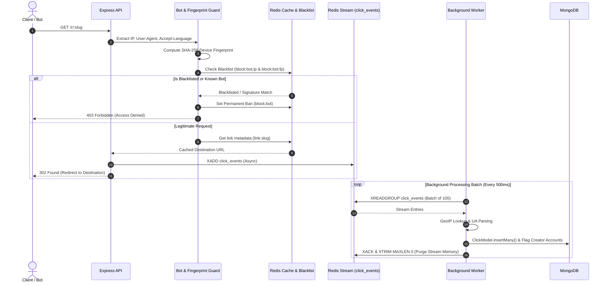

# 🚀 Enterprise Marketing Platform & High-Performance URL Shortener

[](https://opensource.org/licenses/ISC)
[](https://www.typescriptlang.org/)
[](https://nodejs.org/)
[](https://nextjs.org/)
[](https://expressjs.com/)
[](https://www.mongodb.com/)
[](https://redis.io/)

An enterprise-grade, high-throughput short link redirection platform and marketing analytics engine built with **Node.js, TypeScript, Next.js, Express, MongoDB, and Redis Streams**. Engineered to handle **15,000+ redirect requests/sec** with sub-millisecond response times, zero-tolerance automated bot defense, universal device fingerprinting, and zero memory leaks.

---

## 🎯 Key Features

- ⚡ **Ultra-Low Latency Redirects**: Short link resolutions cached in Redis (`link:${slug}`) for 302 redirects without database queries.
- 🛡️ **Zero-Tolerance Bot Protection**: Instant signature detection (blocking Postman, Axios, Python, Curl, Puppeteer, Selenium, etc.) and permanent IP/fingerprint banning in Redis.
- 👤 **Universal SHA-256 Device Fingerprinting**: Generates unique device fingerprints (`IP + User-Agent + Accept-Language`) for every user and bot request.
- ⚡ **Redis Stream Data Pipeline**: Asynchronous click ingestion offloaded to Redis Streams (`click_events`) to keep redirect response times sub-millisecond.
- 🧹 **Zero Memory Leak Stream Purging**: Streams are cleared (`XACK` + `XTRIM MAXLEN 0`) automatically after worker database batch insertion.
- 🌍 **GeoIP & Device Resolution**: Native MaxMind MMDB lookup and User-Agent parsing for real-time location and device breakdown.
- 🚨 **Creator Account Flagging**: Automatically flags creator accounts targeted by bot traffic or spam bursts.
- 🔒 **HTTP-Only Cookie Authentication**: Secure JWT session management using HTTP-Only signed cookies and Axios `withCredentials`.
- 📊 **Real-Time Marketing Analytics**: Interactive dashboard with real vs. bot click ratios, geographic breakdown, device trends, and time-series charts using Recharts.

---

## 🏗️ System Architecture

```mermaid
flowchart TD
    Client[🌐 Client Browser / User]
    Bot[🤖 Bot / Script / Postman]

    subgraph Edge Layer
        CORS[CORS & Helmet Security]
        RL[Redis-Backed Rate Limiter]
        AuthGuard[HTTP-Only Cookie Auth Guard]
    end

    subgraph Application Layer
        Express[Node.js Express App]
        Fingerprint[SHA-256 Fingerprint Generator]
        BotDefense[Permanent Bot Blacklist Filter]
        RedirectService[Redirect Service]
    end

    subgraph In-Memory Cache & Messaging
        RedisCache[(Redis Cache link:slug)]
        RedisStream[[Redis Stream click_events]]
        RedisBlacklist[(Redis Blacklist block:bot)]
    end

    subgraph Data & Background Processing
        Worker[Click Worker Process]
        GeoIP[MaxMind MMDB GeoIP]
        MongoDB[(MongoDB Database)]
    end

    Client --> Edge Layer
    Bot --> Edge Layer
    Edge Layer --> Express

    Express --> Fingerprint
    Fingerprint --> BotDefense
    BotDefense -- Check Blacklist --> RedisBlacklist

    BotDefense -- Blacklisted or Bot Signature --> Ban[403 Forbidden & Permanent Ban]
    BotDefense -- Legitimate Request --> RedirectService

    RedirectService -- 1. Query Cache --> RedisCache
    RedirectService -- 2. Push Event Async --> RedisStream
    RedirectService -- 3. Fast 302 Redirect --> Client

    RedisStream --> Worker
    Worker --> GeoIP
    Worker -- Batch Insert & Stream Clear --> MongoDB
```

---

## 🔄 High-Throughput Redirect & Bot Defense Pipeline



---

## 🛠️ Tech Stack

### Frontend
- **Framework**: Next.js 14 (App Router, React 18, TypeScript)
- **Styling**: Tailwind CSS, Lucide React
- **Charts & Data**: Recharts
- **HTTP Client**: Axios (`withCredentials: true`)

### Backend
- **Runtime & Server**: Node.js, Express, TypeScript
- **Database**: MongoDB, Mongoose
- **Cache & Streaming**: Redis (ioredis, Redis Streams, rate-limit-redis)
- **Security & Auth**: JWT, bcryptjs, Helmet, CORS, Cookie-Parser
- **GeoIP & Analytics**: MaxMind MMDB (`maxmind`), `ua-parser-js`
- **Logging**: Pino, Pino-HTTP

---

## 🚦 API Endpoints Summary

### Authentication (`/api/user/auth`)
| Method | Endpoint | Description | Auth Required |
| :--- | :--- | :--- | :--- |
| `POST` | `/api/user/auth/login` | Authenticate user & set HTTP-Only cookie | No |
| `GET` | `/api/user/auth/logout` | Clear auth cookie and end session | Yes |
| `GET` | `/api/user/auth/me` | Fetch authenticated session profile | Yes |

### Short Links (`/api/admin/links` & `/r/:slug`)
| Method | Endpoint | Description | Auth Required |
| :--- | :--- | :--- | :--- |
| `GET` | `/r/:slug` | Public high-performance link redirect | No |
| `POST` | `/api/admin/links` | Create a new short link (Custom slug supported) | Admin |
| `GET` | `/api/admin/links` | Get all created links | Admin |
| `PUT` | `/api/admin/links/:id` | Update link parameters or status | Admin |
| `DELETE`| `/api/admin/links/:id` | Delete link and invalidate Redis cache | Admin |

### Analytics (`/api/admin/analytics`)
| Method | Endpoint | Description | Auth Required |
| :--- | :--- | :--- | :--- |
| `GET` | `/api/admin/analytics/totals` | Platform-wide totals (clicks, bot ratio, GeoIP) | Admin |
| `GET` | `/api/admin/analytics/creator/:id` | Per-creator analytics rollup | Admin |
| `GET` | `/api/admin/analytics/link/:id` | Detailed link analytics and time-series chart | Admin |

---

## ⚡ Performance & Scalability Highlights

- **Redirect Scalability**: Up to **15,000+ RPS** across cluster processes.
- **Asynchronous Click Storage**: Offloads disk-heavy database writes out of the critical HTTP response path via Redis Streams.
- **Memory Purging**: Runs `XTRIM click_events MAXLEN 0` post-batch insertion to eliminate Redis memory accumulation.
- **Instant Bot Rejection**: Blocks bot requests at the edge before link processing or database queries.

---

## 💻 Local Development & Installation

### Prerequisites
- Node.js >= 18.x
- MongoDB (Running locally or MongoDB Atlas)
- Redis Server (Running locally or Redis Cloud)

### 1. Clone Repository
```bash
git clone https://github.com/Gaganpreet-S1ngh/marketing-platform.git
cd marketing-platform
```

### 2. Backend Setup
```bash
cd backend
npm install
```

Create a `.env` file in `backend/`:
```env
PORT=7007
NODE_ENV=development
MONGODB_URI=mongodb://localhost:27017/marketing_platform
REDIS_HOST=127.0.0.1
REDIS_PORT=6379
JWT_ACCESS_SECRET=your_jwt_access_secret_key
JWT_REFRESH_SECRET=your_jwt_refresh_secret_key
COOKIE_SECRET=your_cookie_signing_secret
APP_URL=http://localhost:7007
FRONTEND_URL=http://localhost:3010
```

Start backend development server & click worker:
```bash
# Terminal 1: API Server
npm run dev

# Terminal 2: Background Click Worker
npm run worker
```

### 3. Frontend Setup
```bash
cd ../frontend
npm install
```

Create a `.env.local` file in `frontend/`:
```env
NEXT_PUBLIC_API_URL=http://localhost:7007
```

Start frontend development server:
```bash
npm run dev
```

Visit the dashboard at `http://localhost:3010`.

---

## 📄 License

This project is licensed under the [ISC License](LICENSE).
